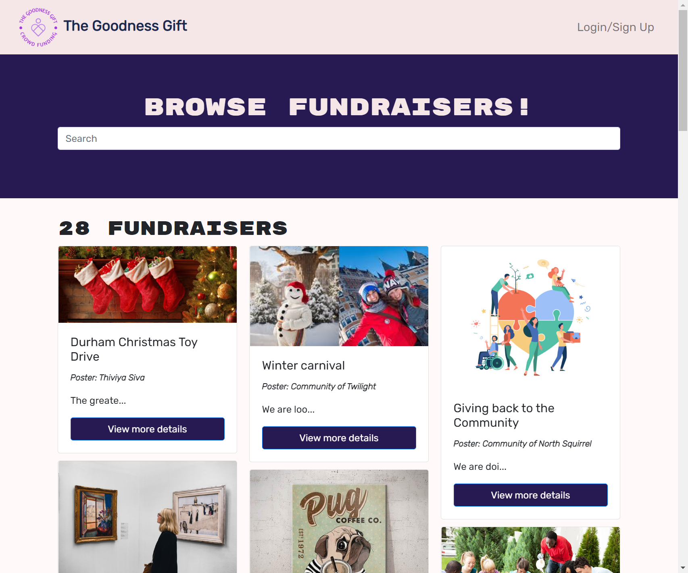
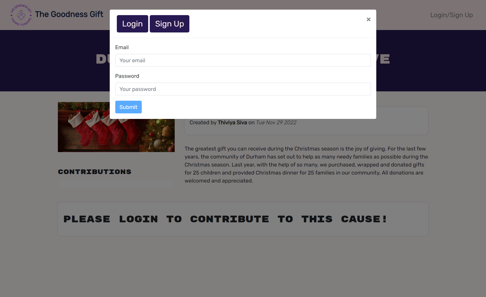
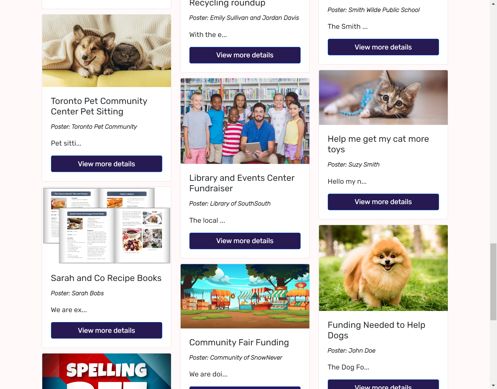
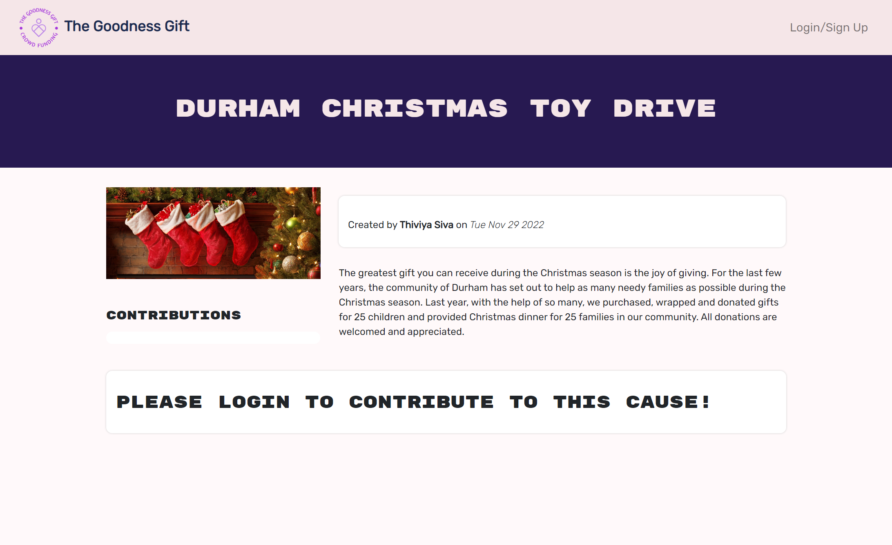
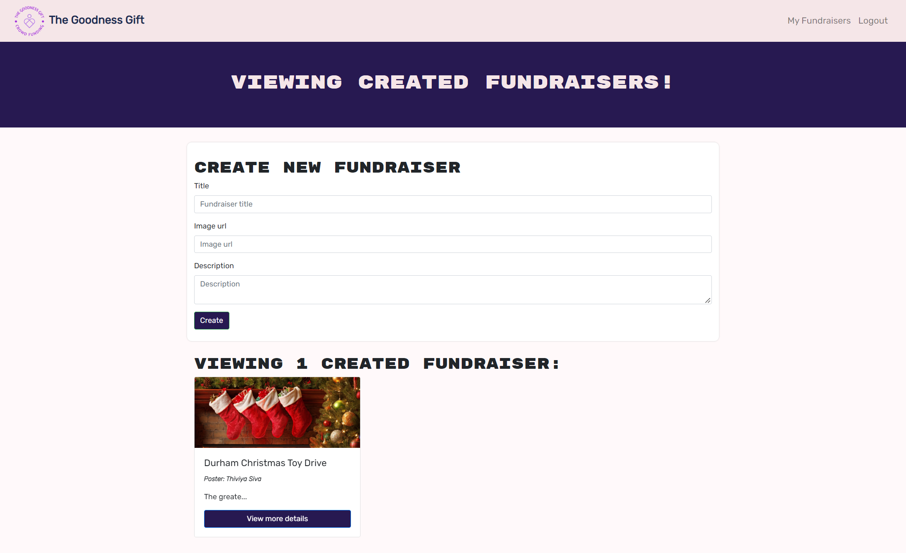
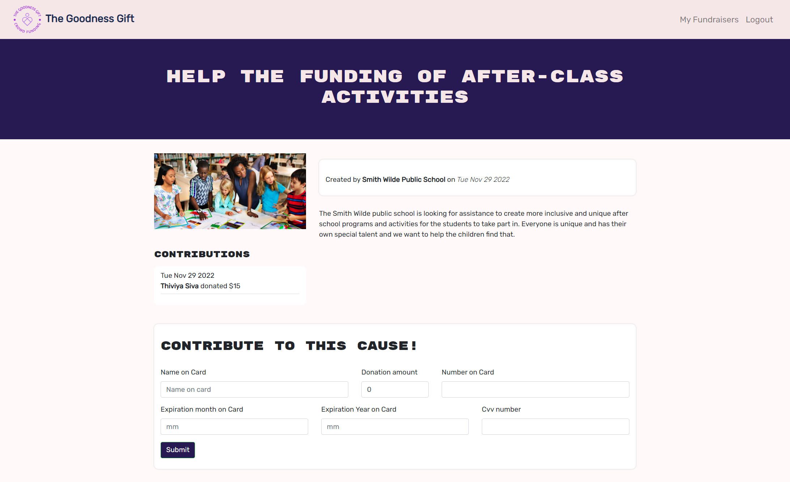

## Interactive MERN Stack Single-Page Application - The Goodness Gift

&nbsp;

## Table of Contents:

- [Description](#description)
- [User Story](#user-story)
- [Acceptance Criteria](#acceptance-criteria)
- [Deployment](#deployment)
- [Visualization](#visualization)
- [Contributors and Github Profile Links](#contributors-and-github-profile-links)
- [Libraries and Technologies Used](#libraries--technologies-used)
- [License](#license)

## Description

The Goodness Gift is a crowd- funding application that will allow people to raise money for events ranging from life events (eg. celebrations, graduations) to challenging circumstances (eg. accidents and illnesses) to community events (eg. school funding, food drives).
Users of this application have the option to 1. Create their own fundraiser post and raise funds for that cause. Or 2. Make a charitable donation to a cause from the list of existing fundraiser posts. At first glance , you will be able to browse from existing fundraisers. However, in order to interact with the site (make your own posts, make a donation, or see other users’ contributed amounts) users would need to either sign up for a new account or login first.

## User Story

```
As a USER,

I WANT TO search for fundraisers/startup,
AND/ OR
I WANT TO make my own fundraiser/startup posts,

SO THAT I CAN learn more information about initiatives in my community and make a donation to the fundraiser of my choice ,
AND/ OR
SO THAT I CAN raise money for my cause.
```

## Acceptance Critera

```
WHEN I visit the site,
THEN I am presented with a landing page with options for users to Sign up/Log in, browse from the available fundraisers , and or narrow their  search for a fundraiser via the filter menu.
WHEN I search for a fundraiser,
THEN I am presented with a list of fundraisers/startups that match that search.
WHEN I click on a fundraiser posts’ view more details,
THEN I can view the fundraiser post’s description, poster users’ details (name and when the post was created, past contributions, and a  message asking me to login to contribute)
WHEN I enter in my name, donation amount, card details into the payment form,
THEN I am able to successfully make a donation.
WHEN I am logged in and click the “my fundraisers” button,
THEN I see the option to either create a fundraiser and/or view my past fundraisers as well.
WHEN I choose the option to start a fundraiser,
THEN I am shown a form where I will input info to start a fundraiser of my choice by entering in my name, description of the event and an  image url.

```

## Deployment

[Proposal](https://docs.google.com/document/d/1ta4Zxrm-0kEhTNWamWjecVx_HhVHa7M1UUcm4nnQdfc/edit)

[Wireframe](https://docs.google.com/presentation/d/1l9n5nf0QuhqiWbokfvvBsPJNKInUdRJ2FP-BJdk-Nz8/edit#slide=id.g19d379c3e15_0_112)

[Deployed Application](https://salty-lowlands-79836.herokuapp.com/)

[Github Repository](https://github.com/thivsiv28/The-goodness-gift)

## Visualization:

##### This is the main page:



#### This is the login/signup window:



##### This is the fundraiser posts view:



#### This is the fundraiser details page view when an user is not logged in:



#### This is the created fundraiser's page view once logged in:



##### This is the view of the fundraisers page and contribution window when an user logs in:



## Contributors and Github Profile Links

[Harmanjot Boparai](https://github.com/HarmanBoparai)

[Muaiz Khan](https://github.com/Muaizkh)

[Thiviya Sivasithamparam](https://github.com/thivsiv28)

## Libraries & Technologies Used:

- [Heroku](https://id.heroku.com/login)
- [Mongodb Atlas](https://www.mongodb.com/atlas/database)
- [React, JSX](https://reactjs.org/)
- [Graph QL](https://graphql.org/)
- [Apollo](https://www.apollographql.com/docs/apollo-server/)
- [Node.JS](https://nodejs.org/en/)
- [Express.js](https://expressjs.com/)
- [MongoDB and Mongoose ODM](https://www.mongodb.com/)
- [JWT](https://jwt.io/)
- [Card validator npm](https://www.npmjs.com/package/card-validator)
- [React bootstrap](https://react-bootstrap.github.io/)
- [React-animated-css npm](https://www.npmjs.com/package/react-animated-css)
- [CSS](https://www.w3schools.com/css/)
- [Javascript](https://www.javascript.com/)
- [Node.js](https://nodejs.org/en/)
- [Bcrypt](https://www.npmjs.com/package/bcryptjs)

## License

MIT License [](https://opensource.org/licenses/MIT)

Copyright (c) 2022 thivsiv28

Permission is hereby granted, free of charge, to any person obtaining a copy
of this software and associated documentation files (the "Software"), to deal
in the Software without restriction, including without limitation the rights
to use, copy, modify, merge, publish, distribute, sublicense, and/or sell
copies of the Software, and to permit persons to whom the Software is
furnished to do so, subject to the following conditions:

The above copyright notice and this permission notice shall be included in all
copies or substantial portions of the Software.

THE SOFTWARE IS PROVIDED "AS IS", WITHOUT WARRANTY OF ANY KIND, EXPRESS OR
IMPLIED, INCLUDING BUT NOT LIMITED TO THE WARRANTIES OF MERCHANTABILITY,
FITNESS FOR A PARTICULAR PURPOSE AND NONINFRINGEMENT. IN NO EVENT SHALL THE
AUTHORS OR COPYRIGHT HOLDERS BE LIABLE FOR ANY CLAIM, DAMAGES OR OTHER
LIABILITY, WHETHER IN AN ACTION OF CONTRACT, TORT OR OTHERWISE, ARISING FROM,
OUT OF OR IN CONNECTION WITH THE SOFTWARE OR THE USE OR OTHER DEALINGS IN THE
SOFTWARE.
